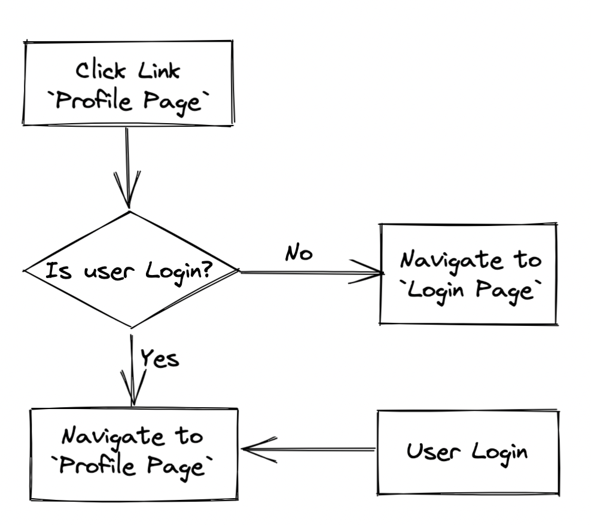

# React Router Foundation

## References

- [Default create-react-app README.md](./create-react-app-readme.md)
- [React Router Tutorial](https://reactrouter.com/docs/en/v6/getting-started/tutorial)
- [React Router API Reference](https://reactrouter.com/docs/en/v6/api)

## Environment Setting

```sh
# create create app
$ npx create-react-app <project-name>
# install react-router-dom version 6
$ npm i react-router-dom@6
```

## Configuring Routes

### Foundation
1. Use `BrowserRouter` component wraps the `App component` in [index.js](./src/index.js)
2. Building `Routes & Route` structure in [App.js](./src/App.js)
3. Navigatioin
    - About path
        If the to path starts with `"/"`, then it's an `absolute path`, otherwise a `relative path`
    - [see navlink detail see here](./notes/navlink.md)
    - [navigating programmatically see here](./notes/navigating-programmatically.md)
4. Handle `no match routes` in [App.js](./src/App.js)
    - `<Route path="*" element={<NoMatch />} />`
5. Nested routing
    - `<Outlet>` - An `<Outlet>` should be used in parent route elements to render their child route elements. Outle demo see [NestedRoute/index.js](./src/pages/NestedRoute/index.js)
    - If the parent route matched exactly, it will render a `child index route`, e.g. `<Route index element={<IndexCompponent />}>`, or nothing if there is no index route. Route index demo see [App.js](./src/App.js)

### Advanced - Dynamic Routes

- Handle dynamic routing: `<Route path="/page/:id" />`. dynamic routing demo see [App.js](./src/App.js)
- Get URL parameters: `useParams()`
    - [Reference - userParams](https://reactrouter.com/docs/en/v6/api#useparams)
    - userParams() demo see [Users/UsersDetail.js](./src/pages/Users/UsersDetail.js)
- Get & Set search parameters: `useSearchParams()`
    - [Reference - useSearchParams](https://reactrouter.com/docs/en/v6/api#usesearchparams)
    - userSearchParams() demo see [Users/index.js](./src/pages/Users/index.js)

### Advanced - Lazy Loading

Using this technique, pages that are not required on the home page can be split out into separate bundles, thereby decreasing load time on the initial page and `improving performance`.

- import: `const LazyComponent = React.lazy(() => import('/component/path'))`
- Usage: `<Route path="path" element={<React.Suspense fallback="Loading..."><LazyComponent /></React.Suspense>} />` 
- demo see [App.js](./src/App.js)

### Advanced - Authentication & Protected Routes


Steps
1. Create [auth.js](./src/auth/index.js), createContext for global variable
2. Wrap all App with AuthProvider in [index.js](./src/index.js)
3. Create [Login Page](./src/pages/Login.js), handle user login
    - NOTE: set `replace: true` before navigating
    - Reason: Normally a call to navigate will push a new entry into the history stack so the user can click the back button to get back to the page. If you pass replace: true to navigate then the current entry in the history stack will be replaced with the new one.
    - Advanced - `useLocation`, redirect to the path which the value is from [RequireAuth.js](./src/components/RequireAuth.js)
4. Create [Profile Page](./src/pages/Profile.js), handle user logout
5. Edit [App.js](./src/App.js), adding the route
6. Edit [Navbar.js](./src/components/Navbar.js)
    - user not login -> show `Login`
7. Advanced - Create reuseable wrap component [RequireAuth.js](./src/components/RequireAuth.js), for checking user is login
    - the component will render first
    - if user is login -> render children component
    - if user is NOT login -> redirect to login page